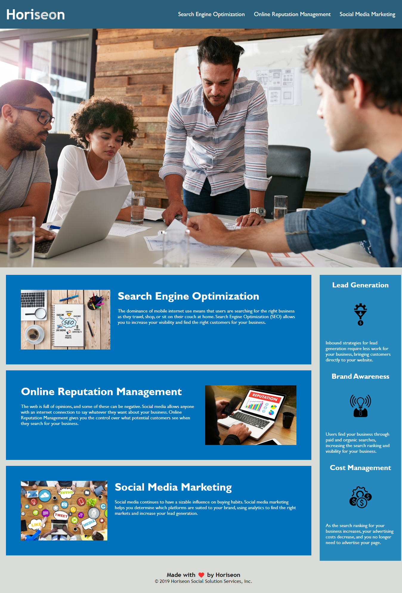

# Horiseon Web Page Enhancements
The goal of these enhancements is to meet accessibility standards and have better Search Engine Optimization
## Accessibility Changes to HTML
Several div elements were replaced with elements such as header, footer, and section to create easier to understand code.  
Title updated to better describe the webpage.  
Search Engine Optizmation navigation link fixed.  
Section 2 headers were updated to h2 for better understanding for screen readers.  
Comments added to identify each partition of code, can be used to relate to the CSS sheet as well.  
## Accessibility Changes to CSS
Comments added to identify and group which elements code applies to.  
Consolidated classes in Section 1 and 2 to get rid of repititive code.  
Rearranged lines of code so they flow naturally with the structure of the HTML elements.  
## Website Snapshot
 
## Link to Web Page
https://mjd10m.github.io/Horiseon-Web-Page-Enhancements/

